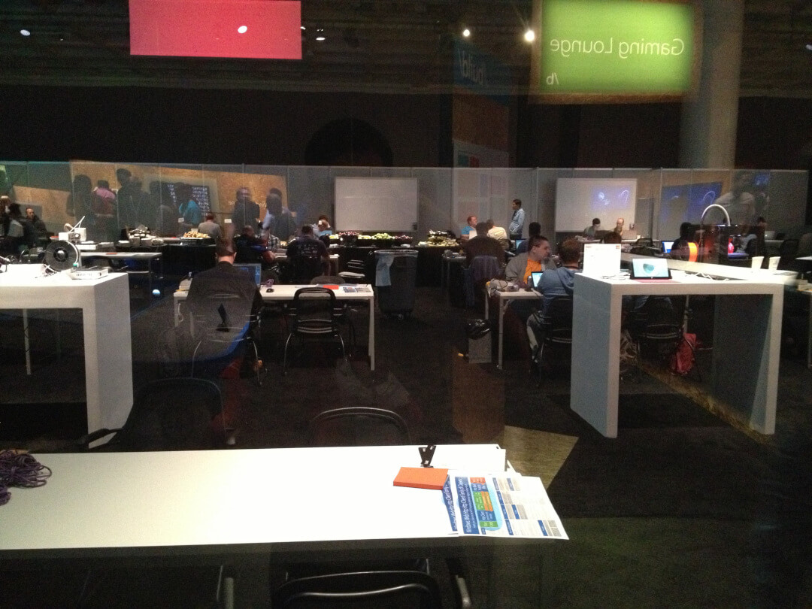
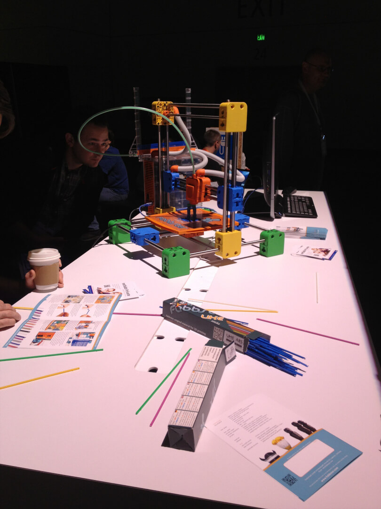
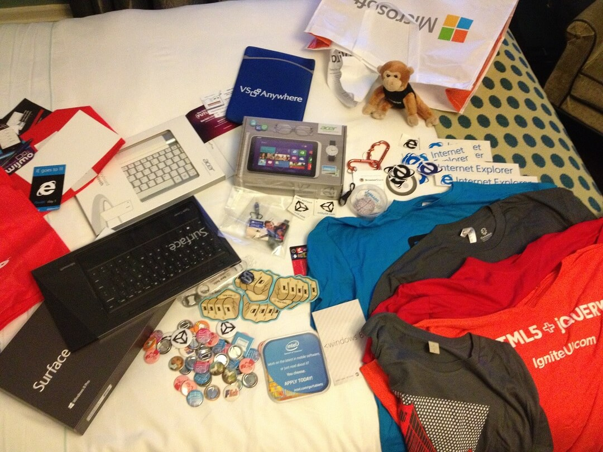

Day 1 was pretty awesome. I've included links to the sessions on Channel 9. Videos of the sessions should be up in a couple of days. I'd encourage you to check them out when posted.

### [Day 1 Keynote](http://channel9.msdn.com/Events/Build/2013/1-001)

Keynote showed a lot of good information about Windows 8.1, Bing Apps, and Spark.

8.1 has some really cool features that a lot of people feel should have come with Windows 8. There is now a good blend between Modern apps and Desktop apps. You get the start button back. There is better multi monitor support and multitasking modern apps.

We had time to check out the vendors, device labs and other areas before the sessions.

 Sweet prop gun you can win by using certain APIs in your Win 8 app.

### Session 1 - [Windows Phone: Design for Developers](http://channel9.msdn.com/Events/Build/2013/2-202)

As a developer, this was a great session. Corrina show a lot of great tools that any developer can use to help make apps look better without having to know all the ins and outs of designs.

### Session 2 - [New Platform Capabilities for Advancing Web Development](http://channel9.msdn.com/Events/Build/2013/2-067)

This session was packed, but there was a ton of good stuff. New features in video DRM, in browser encryption, and immersive graphics with WebGL.

My favorite part of this session was the demo of the new tool features of IE's dev tools You no longer need to refresh your DOM with dynamic content, CSS shorthands can be expanded into individual properties, and you can search the DOM based on CSS selectors. I really see this as my new development browser of choice.

### Session 3 - [What's New in WinJS](http://channel9.msdn.com/Events/Build/2013/2-165)

I got a lot out of this session. I've tried to do a lot of stuff in Win 8 apps. A ton of the features I was trying to do are now included. There are also drastic improvements by simply upgrading to WinJS 2.0.

### Session 4 - [Windows 8.1 in the enterprise](http://channel9.msdn.com/Events/Build/2013/2-194)

This session had some pretty exciting stuff. There are great improvements in BYOD and security features of 8.1. I can't speak in great detail on these, but they are pretty awesome. You can setup an RT device to access your work files without adding it to the domain (if setup properly) by using a dual authentication process. You sign in normally and then you get a secondary auth by phone.

There is also file encryption that can be utilized to de-auth access of a lost device or a specific set of files. The example was you use and HR app on your RT device, but then leave the HR department to work as a PM. Your server administrator can revoke access of the HR app and not the whole device.

 Hackathon participants got an exclusive work area. Experts roam in the area to help out.

] One of the many 3D printers on display

 End of day swag pickup. The line wrapped around the entire meal area and all the way to the other side of the convention center. We waited in line over an hour. It was worth it though.

It was a really great first day. I'm pretty worn out, but I'm ready for tomorrow!

Where I'll be tomorrow:
11:30AM to 12:30PM
What’s New in ASP.NET and Visual Studio 2013
Scott Hanselman

2:00PM to 3:00PM
Scaling the Real-time Web with ASP.NET SignalR
Damian Edwards

3:30PM to 4:30PM
ASP.NET Web API 2 – Web Services for Websites, Modern Apps, and Mobile Apps
Daniel Roth

5:00PM to 6:00PM
Windows Phone: Learn from the Winners
