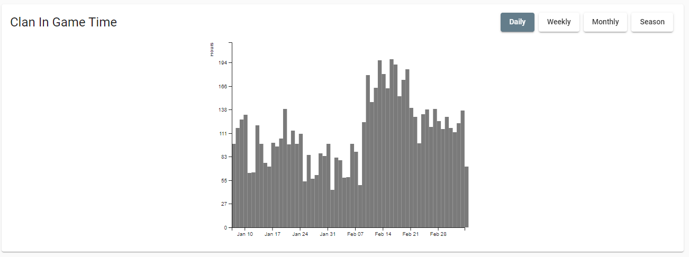
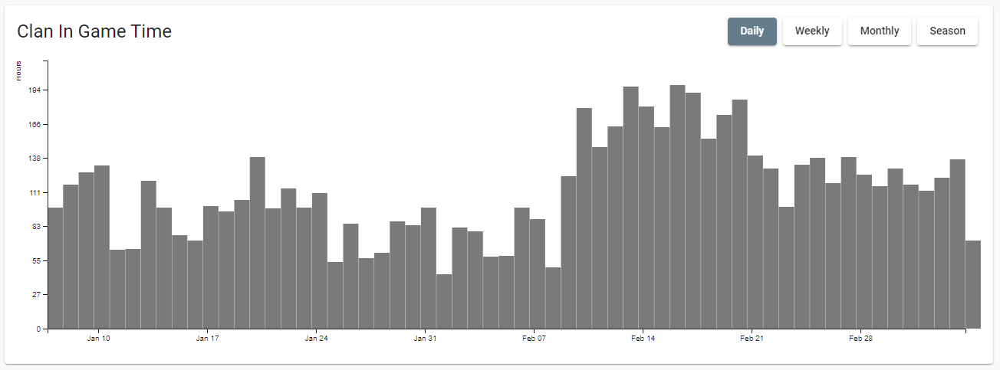

I've been working on my side project [Destiny Clan Dashboard](https://destinyclandashboard.com/) since late 2018. One of the primary reasons for this was to become more proficient in Angular and D3, a charting library.  I've been working on this somewhat daily for 30 minutes to an hour a day before the kids get up or after they went to bed. This is the absolute worst way to do a side project if you are wanting results fast.

I've spent roughly the last two months building out D3 charts for the home screen to help display how active a Destiny Clan has been.  About half that time was spent getting the data need and the other half rendering the data.

D3 charts are rendered within a [Scalable Vector Graphic](https://developer.mozilla.org/en-US/docs/Web/SVG). SVG for short. SVGs are marvelous in the web world because you can take one image and scale it infinitely to any size.  You typically see icons rendered this way.

D3 allows you to dynamically create these as a chart.  My first solution was somewhat responsive.  I had set the SVG's viewbox to fixed ration of 200 units tall and 300 units high.  This forced the charts ratio to be very consistent and it could grow based on the screen size.  This was just an OK solution.  Really large screen sizes would end up with an excessively large chart.

I decided to set a max width to the element to prevent this. The result was a lot better, but resulted in a lot of extra white space.



I did a little research and figured out how to make a full width chart.  I run a little JavaScript to determine the width and apply that to the x axis.

```typescript
// Before
this.svg = d3
   .select(this.hostElement)
   .attr('class', 'activity-heatmap')
   .append('svg')
   .attr('width', '100%')
   .attr('viewBox', `0 0 ${this.chartWidth} ${this.chartHeight}`

// After
this.svg = d3
      .select(this.hostElement)
      .attr('class', 'activity-heatmap')
      .append('svg')
      .attr('height', this.chartHeight)
      .attr('width', '100%');

// Calculate the available height and width
const bounds = this.svg.node().getBoundingClientRect(),
      width = bounds.width - this.margin.left - this.margin.right,
      height = bounds.height - this.margin.top - this.margin.bottom;


// Apply available ranges downstream
```

Result:



the above solution worked out great, but there was one big drawback. The chart would remain the same size if the user resized the page.  I needed to add code that would redraw the chart whenever the user resized their browser.

This part is Angular specific.  I added this block of code to the component constructor.

```typescript
 constructor(private zone: NgZone) {

    this.zone.runOutsideAngular(() => {
      fromEvent(window, 'resize')
        .pipe(
           debounceTime(500),   // Only run after a half second paus
           distinctUntilChanged() // don't run if the screen resize is the same
         )
        .subscribe((e: Event) => {
          this.zone.run(() => {
            this.changeSubject.next(e);  // Trigger subscription update
          });
        });

    });
    this.changeSubject.subscribe((e: Event) => {
      this.updateChart(this.events);   // Trigger chart redraw
    });
  }
```

This was a straight copy and past from Stack Overflow.  I haven't done much with `NgZone` in the past, but I'm going to dig through and get a better understanding of what's going on.

The most important line of code is the `debounceTime(500)` call.  Window resizes and window scrolls fire of a significantly high number of times. We turn 20 or 30 calls to just one by delaying the event trigger.

### Bonus: Animations

Animations add a really great touch to data visualizations. CSS and JavaScript animations are pretty straight forward because I've been doing them for years.  I haven't done them in D3 before I wanted to add something nice.  It turned out to be a lot easier than I expected.

```typescript
// Creates bars

bars
    .attr('class', 'activity-bar')
    .attr('x', (d) => {
        return this.x(d.date);  // Sets bar x position
    })
    .attr('width', (d) => {
        return width / cleanedData.length;  // Sets the bar width
    })
    .attr('y', (d) => {
        return this.y(0);  // Sets to zero
    })
    .attr('height', 0);


// Declare transition
const t = d3.transition().duration(500);

// Animates bars


bars
    .transition(t)  // Apply transition
    .attr('y', (d) => {
        return this.y(d.seconds);
    })
    .attr('height', (d) => {
        return height - this.y(d.seconds);
    });
```

I didn't think about it much, but the anchor of the bar starts from the top and not the bottom. Setting the `y` position to `0` will make the chart grow up from our bottom x axis instead of grown down from the top x axis.

You can checkout my project at [https://destinyclandashboard.com/](https://destinyclandashboard.com/) or checkout my source code at [https://github.com/WorthyD/d2-clandashboard](https://github.com/WorthyD/d2-clandashboard)
