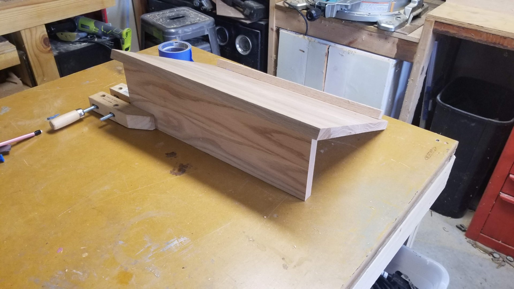
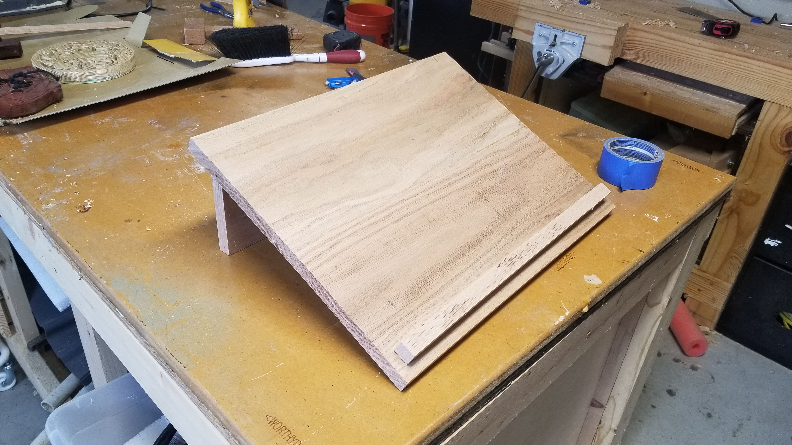
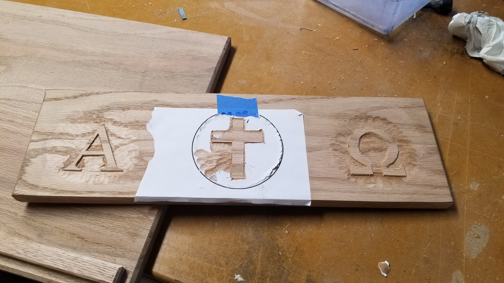
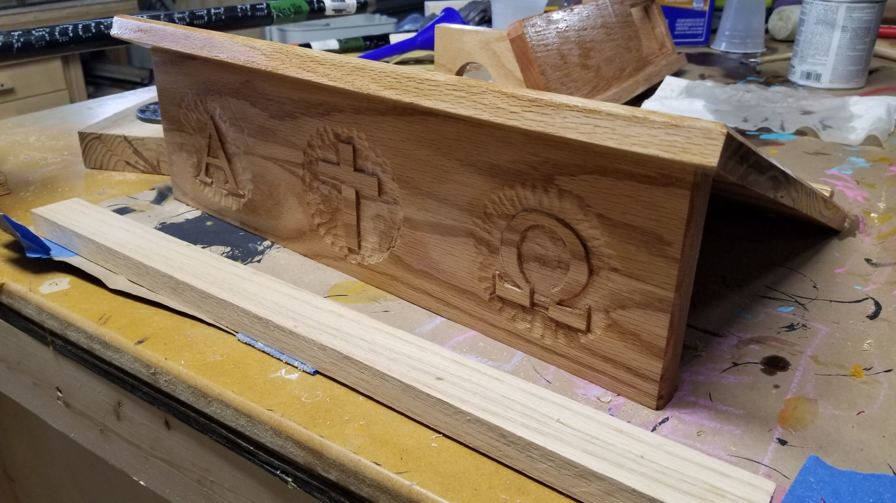
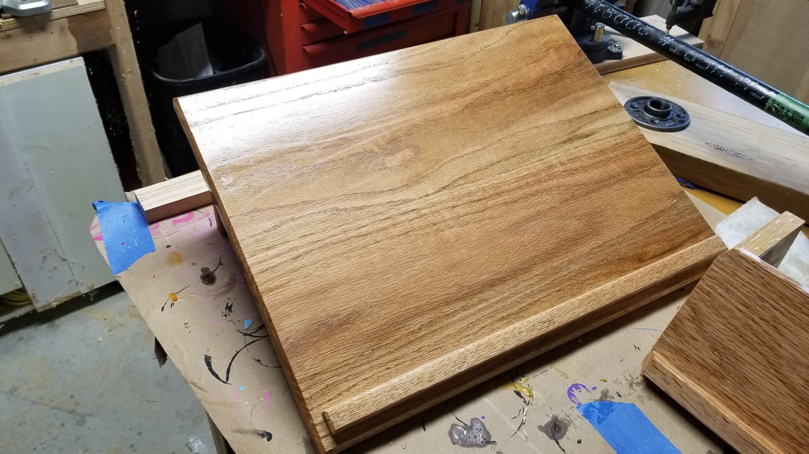

This project started like the other project I did for the church. My pastor texted me asking me to call him when I get a chance. This maneuver just causes anxiety for some one like me. I called him and he asked me if I would be interested in building a missal stand for the church. I heard 'missile stand' and got really confused. He explained the purpose of it and it make sense. A missal stand is used to hold the Bible or literature during communion. A missal stand from Church Stuff R Us run at a minimum of 300 dollars. Most of them are only made out of 3 pieces of wood. I partially wanted to take this on to save the church a couple hundred dollars.

I love getting to build stuff for other people, but the anxiety of quality and timeline is really high. I typically tell people I don't do commissions because I don't know how much my work is worth and I can't commit to timelines. Woodworking is a hobby. I also have a wife and two kids that I prioritize. My time is very valuable to me.

I picked up an 8" by 4' oak board from a big box store for \$30. I played around with angles to figure out what would be most sturdy. I wanted to keep the solution metal free. I thought about using dowels, but I didn't think I could get the angles right. I put a datto/recessed slot into the top piece for the base piece to slot into. It left a lot of room to work with. I couldn't come up with a good way to clamp the piece. I stacked about 70 pounds of weights on it during glue up.

I felt the need to add some flare to this project. I chamfered all the edges for visuals, but wanted to do something more. I asked and got approval to carve an alpha, an omega and a cross into the base. I haven't done any carving before and I decided to invest in a beginner carving set that was recommended by [Wood by Wright](https://www.woodbywright.com/)

I practiced carving a Celtic knot and a Methodist cross. I spent about 3 hours carving the alpha, 2 hours on the omega and a bit over an hour and a half on the cross.

I put 3 coats of high gloss poly and called it good. I tossed it a bag and had my wife deliver it. My wife works for our church so it's not that odd .

Our pastor was super excited about getting g it. They'll be using it for every communion. I'm pretty happy with the result.
